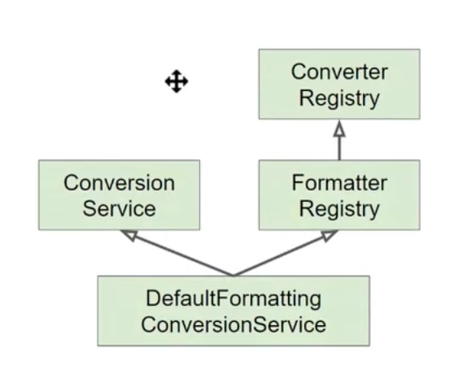

# 데이터바인딩 추상화 : Converter 와 Formatter

## Converter

- PropertyEditor의 단점 때문에 Converter가 만들어짐
- 일반적인 바인딩이 가능
- ConverterRegistry에 등록해서 사용

## Formatter

- PropertyEditor 대체제
- Object와 String간의 변환을 담당
- 문자열을 Locale에 따라 다국화하는 기능도 제공(Optional)
- FormatterRegistry에 등록해서 사용

## ConversionService

>타입을 변환하는 작업은 DataBider를 대신해 ConversionService가 일을 한다.

- 실제 변환 작업은 이 인터페이스를 통해 쓰레드-세이프 하게 사용가능
- 스프링MVC, 빈(value)설정, SpEL에서 사용
- 스프링이 제공해주는 ConversionService 구현체중
>  DefaultFormattingConversionService 
>> - FormatterRegistry의 기능
>> - ConversionService의 기능
>> - 여러 기본 컨버터와 포매터를 등록 해 줌.
>> 

#### 스프링부트
- 웹 어플리케이션인 경우 DefaultFormattingConversionService를 [상속하여 만든](./src/main/java/databindingconverterformatter/demo/AppRunner.java) WebConversionService를 빈으로 등록해준다.
- Formatterd와 Convertter 빈을 찾아 자동으로 등록 해준다.