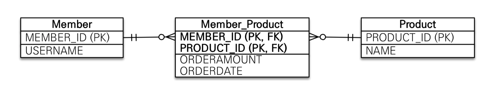
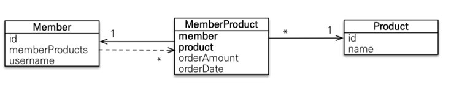
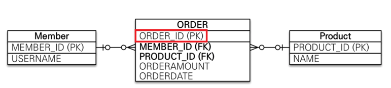

# 다양한 연관관계 매핑

## 다대일

- 다대일 관계의 반대방향은 항상 일대다 관계이고 일대다의 반대 방향은 항상 다대일 관계이다.
- 테이블의 일(1), 다(N)관계에서 외래 키는 항상 다쪽에 있다.
- 객체의 양방향 관계에서 연관관계의 주인은 항상 다 쪽이다.
    - 예를 들어 회원(N),팀(1) 이 있으면 회원이 연관관계의 주인이다.

### 다대일 단방향[N:1]


- 회원은 Member.team으로 팀 엔티티를 참조할 수 있지만 반대로 팀에는 회원을 참조하는 필드가 없다. 따라서 회원과 팀은 다대일 단방향 연관관계

```java
@ManyToOne
@JoinColumn(name = "TEAM_ID")
private Team team;
```

- `@JoinColumn(name = "Team_ID")`을 사용해서 `Member.team` 필드로 회원 테이블의 `TEAM_ID`외래키를 관리한다.

### 다대일 양방향


- 연관관계의 주인은 Member.team이고 Team.members는 연관관계의 주인이 아니다.

`양방향은 외래 키가 있는 쪽이 연관관계의 주인이다.`

- 일대다와 다대일 연관관계는 항상 다(N)에 외래키가 존재한다.
    - 여기서는 다(N)쪽인 MEMBER테이블이 외래키를 가지고 있으므로 Member.team이 연관관계의 주인이다.
- JPA는 외래키를 관리할때 연관관계의 주인만 사용한다.
    - 주인이 아닌 Team.members는 조회를 위한 JPQL이나 객체 그래프를 탐색할 때 사용한다.

`양방향 연관관계는 항상 서로를 참조해야한다.`

- 양방향 연관관계는 항상 서로 참조해야한다. 어느 한쪽만 참조하면 양방향 연관관계가 성립하지 않는다.

## 일대다

- 일대다 관계는 다대일 관계의 반대 방향이다.
- 일대다 관계는 엔티티를 하나 이상 참조할 수 있으므로 자바 컬렉션인 `Collection`, `List`, `Set`, `Map` 중에 하나를 사용해야 한다.

### 일대다 단방향[1:N]


- 하나의 팀은 여러 회원을 참조할 수 있는데 이런 관계를 일대다 관계라 한다.
- 팀은 회원들을 참조하지만 반대로 회원은 팀을 참조하지 않으면 둘의 관계는 단방향이다.(1:N 단방향 관계는 JPA2.0부터 지원)
- Team.members로 회원 테이블의 TEAM_ID 외래키를 관리한다.
    - 보통 자신이 매핑한 테이블의 외래 키를 관리하는데 이 매핑은 반대쪽 테이블에 있는 외래키를 관리한다.

`일대다 단반향 매핑의 단점`

- 단반향 매핑의 단점은 매핑한 객체가 관리하는 외래키가 다른테이블에 있다.
- 본인테이블에 외래 키가 있으면 엔티티의 저장과 연관관계 처리르 `INSERTE SQL` 한번으로 처리가 가능하지만 다른테이블에 외래키가 존재하면 연관관계 처리를 위한 추가적인 `UPADATE SQL` 이
  필요하다.

### 일대다 양방향

- 일대다 양방향 매핑은 존재하지 않는다. 대신 다대일 양방향 매핑을 사용한다.
    - 양방향 매핑에서 `@OneToMany`는 연관관계의 주인이 될수 없다. 다대일 관계는 항상 다쪽에 외래 키가 있다. 따라서 `@OneToMany`, `@ManyToOne` 둘중에 연관관계의 주인은 항상 다
      쪽인 `@ManyToOne`을 사용한 곳이다.
- 일대다 단방향 매핑 반대편에 다대일 단방향 매핑을 추가한다. 이때 일대다 단방향 매핑과 같은 `TEAM_ID` 외래 키 컬럼을 매핑한다. 이렇게 되면 둘다 같은 키를 관리하므로 문제가 발생할 수 있다. 따라서
  반대편인 다대일 쪽은 `
  `insertable= false, updatable = false`로 설정해서 읽기만 가능하게 매핑한다.
- 해당 방법은 일대다 양방향 매핑이라기 보다는 일대다 단방향 매핑 반대편에 다대일 단방향 매핑을 읽기전용으로 추가해서 일대 다 양방향 처럼 보이게 하는 방법이다.
  `일대다 단방향 매핑이 가지는 단점을 그대로 가지므로 될수있으면 다대일 양방향 매핑을 이용하는 것이 좋다`

## 일대일 [1:1]

일대일 관계는 양쪽이 서로 하나의 관계만 가진다.
> 예: 회원은 하나의 사물함만 사용하고 사물함도 하나의 회원에 의해서만 사용된다.

- 일대일 관계는 그 반대도 일대일 관계이다.
- 테이블 관계에서 일대다. 다대일은 항상 다(N)쪽이 외래키를 가진다. 반면에 일대일 관계는 주테이블이나 대상 테이블 둘중 어느 곳이나 외래키를 가질수 있다.

### 주테이블에 외래키

주객체가 대상 객체를 참조하는 것처럼 주 테이블에 외래키를 두고 대상테이블을 참조한다. 외래키를 객체참조와 비슷하게 사용할 수있다. JPA도 주 테이블에 외래키가 있으면 좀더 편리하게 매핑이가능하다.

#### 단방향


- 1:1 관계 이므로 객체 매핑에 `@OneToOne`을 사용했고 데이터베이스에는 `LOCKER_ID` 외래키에 유니크 제약 조건을 추가 했다.

#### 양방향


- 양방향이므로 연관관계의 주인을 정해야한다. `MEMBER`테이블이 외래키를 가지고 있으므로 `Member` 엔티티에 있는 `Member.locker`가 연관관계의 주인이다.
- 반대 매핑인 사물함의 `Locker.member`는 `mappedBy`를 선언해서 연관관계의 주인이 아니라고 명시해야한다.

### 대상 테이블에 외래키

전통적인 데이터베이스 개발자들은 보통 대상테이블에 외래키를 두는것을 선호한다. 이 방법의 장점은 테이블 관계를 일대일에서 일대다로 변경할 때 테이블 구조를 그대로 유지할수 있다.

#### 단방향


- 일대일 관계중 대상 테이블에 외래 키가 있는 단방향 관계는 JPA에서 지원 하지 않는다. 이런 모양으로 매핑할 수 있는 방법 또한 존재하지 않는다.

#### 양방향


- 일대일 매핑에서 대상 테이블에 외래키를 두고 싶으면 이렇게 양방향ㅇ으로 매핑한다 주 엔티티인 `Member`엔티티 대신에 대상인 엔티티인 `Locekr`를 연관관계의 주인으로 만들어서 `LOCKER`테이블의
  외래키를 관리하도록한다.

## 다대다 [N:N]

관계형 데이터 베이스는 정규화된 테이블 2개로 다대다 관계 표현할수 없다. 그래서 보통 다대다 관계를 일대다, 다대일 관계로 풀어내는 연결 테이블을 사용한다.


> 예를 들어 회원들은 상품을 주문한다.
> 상품은 회원들에 의해 주문된다. 이 둘은 다대다 관계이며 회원테이블과 상품 테이블 만으로는 이 관계를 표현할수 없다.


> 그래서 위와 같이 중간에 연결 테이블을 추가해야한다.`Member_Product`라는 테이블을 통해 다대다 관계를 1:N, N:1로 풀어 낼수 있다.
> 이 연결 테이블은 회원이 주문한 상품을 나타낸다.


하지만 객체는 테이블과 다르게 객체 2개로 다대다 관계를 나타낼수 있다.
> 예를 들어 회우너 객체는 컬렉션을 사용해서 상품들을 참조하면 되고 반대로 상품들도 컬렉션을 사용해서 회원들을 참조 하면된다.
> `@ManyToMany`를 사용하면 이런 다대다 관계를 편리하게 매핑할수 있다.

#### 단방향

회원 엔티티와 상품엔티티를 `@ManyToMany`로 매핑을 했다. `@ManyToMany`와 `@JoinTable`을 사용해서 연결테이블을 바로 매핑을 하였다. 따라서 회원과 상품을
연결하는 `MEMBER_PRODUCT` 엔티티 없이 매핑을 할수 있다.

```java
@ManyToMany
@JoinTable(name = "MEMBER_PRODUCT", joinColumns = @JoinColumn(name = "MEMBER_ID"),
        inverseJoinColumns = @JoinColumn(name = "PROUDCT_ID"))
private List<Product> products=new ArrayList<>();
```

> 위 코드의 연결테이블 매핑하는 `@JoinTable` 속성 정리
> - `@JoinTable.name` : 연결 테이블을 지정(`MEMBER_PRODUCT`테이블)
> - `@JoinTable.joinColumns` : 현재 방향인 회원과 매핑할 조인컬럼 정보를 지정 (`MEMBER_ID`로 지정)
> - `@JoinTable.inverseJoinColumns`: 반대 방향인 상품과 매핑할 조인 컬럼 정보를 지정(`PROUDCT_ID`로 지정)

#### 양방향

다대다 매핑이므로 `Proudct`엔티티에서도 `Member`를 역방향도 `@ManyToMany`로 사용한다. 양쪽중 원하는 곳에 `mappedBy`로 연관관계의 주인을 지정한다.(`mappedBy`가 없는곳이
연관관계의 주인)

```java
    public static void findInverse(EntityManager em){ //객체그래프 역방향탐색
        Product product=em.find(Product.class,"productA");
        List<Member> members=product.getMembers();
        for(Member member:members){
        System.out.println("member = "+member.getUsername());
        }
        }
```

- 양방향 연관관계로 만들었으므로 `product.getMembers()`를 이용하여 역방향으로 객체 그래프를 탐색할 수 있다.

### 다대다: 매핑의 한계와 극복, 연결 엔티티 사용

- 다대다 매핑 (`@ManyToMany`)을 이용하면 연결테이블을 자동으로 처리해주므로 도메인 모델이 단순해지고 여러가지로 편리함
- 하지만 회원이 주문을 하면 주문한 회원과 물품만 테이블에 담고 끝나지 않고 연결테이블에 주문수량, 주문날짜같은 컬럼이 더필요하다
  
- 해당 그림을 보면 연결테이블에 주문 수량과 주문 날짜 컬럼을 추가 했다. 이렇게 컬럼을 추가하면 더는 다대다 매핑을 이용할수 없다.
- 결국 이 다대다 관계를 아래 그림과 같이 1:N, N:1로 풀어야 한다.
  

```java

@Entity
@IdClass(MemberProductId.class)
@Getter
@Setter
public class MemberProduct {

    @Id
    @ManyToOne
    @JoinColumn(name = "MEMBER_ID")
    private Member member;

    @Id
    @ManyToOne
    @JoinColumn(name = "PRODUCT_ID")
    private Product product;

    private int orderAmount;
}
```

- 해당 회원상품 엔티티를 보게 되면 기본키를 매핑하는 `@Id`와 외래키를 매핑하는 `@JoinColumn`을 동시에 사용해서 기본키 + 외래키를 한번에 매핑 하였다
- `@IdClass`를 사용하여 복합 기본키를 매핑했다.

> 복합기본키
> - 회원 상품 엔티티는 기본키가 `MEMBER_ID`,`PRODUCT_ID`로 이루어져있.
> - JPA에서 복합 기본키를 사용하려면 별도의 식별자 클래스를 만들어야 한다. 그리고 엔티티에 `@IdClass`를 사용해서 식별자 클래스를 지정하면된다
> - 복합키를 위한 식별자 클래스
    >

- 복합키는 별도의 식별자 클래스로 만들어야 한다.

> - `Serializable`을 구현해야 한다
>   - `equals`, `hashCode` 메서드를 구현해야한다
>   - 기본 생성자가 있어야한다
>   - 식별자 클래스는 `public`이어야 한다.
>   - `@IdClass`를 사용하는 방법 외에 `@EmbeddedId`를 사용하는 방법도 있다.

### 다대다 새로운 기본키사용
기본키 생성전략을 데이터베이스에서 자동으로 생성해주는 대리 키를 `Long`값으로 사용하면 기본키를 거의 영구히 사용 가능하며 비즈니에 의존하지 않는다.
ORM 매핑시 복합키를 만들지 않아도 되므로 간단히 매핑이 가능하다.

> 추가적으로 JPA에서 ORDER 테이블을 매핑할때 오류가 발생 하였는데 
> DB에서는 ORDER가 예약어 이기 때문에 테이블 명을 변경 해주어야한다  예:-->`@Table(name="orders")`

### 다대다 연관관계 정리
다대다 관계를 1:N, N:1로 풀어내기 위해 연결 테이블을 만들 때 식별자를 어떻게 구성할지 선택해야한다.
- 식별관계 : 받아온 식별자를 기본키 + 외래키로 사용
- 비식별 관계 : 받아온 식별자는 외래키로만 사용하고 새로운 식별자를 추가한다.