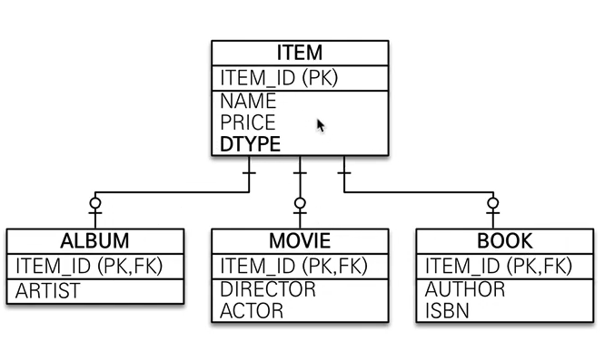
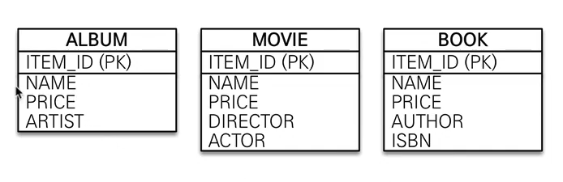
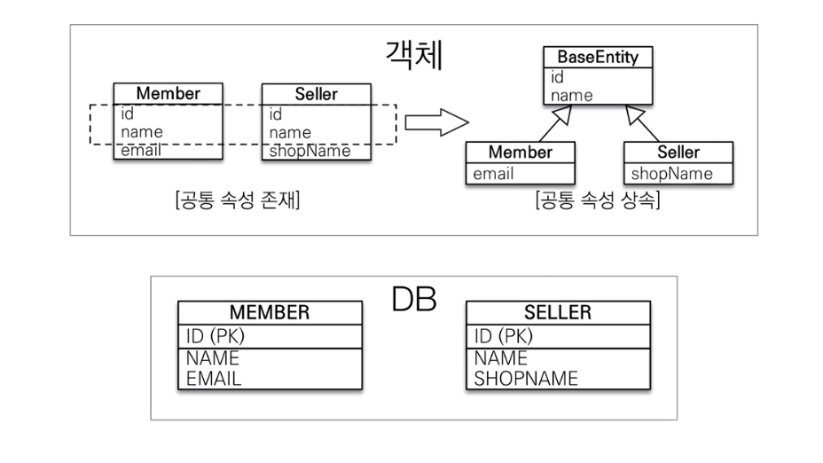
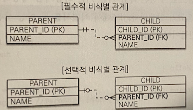

# 고급매핑

- 상송관계매핑 : 객체의 상속 관계를 데이터베이스에 매핑하는법
- `@MappedSuperClass` : 등록일, 수정일 같이 여러 엔티티에서 공통으로 사용하는 매핑 정보만 상속 받고 싶을때 사용
- 복합키와 식별 관계 매핑 : DB의 식별자가 하나 이상일 경우 매핑하는법
- 조인 테이블 : 테이블 외래 키 하나로 연관관계를 맺을수 있찌만 연관관계를 관리하는 연결테이블을 두는 방법
- 엔티티 하나에 여러 테이블 매핑하기 : 엔티티하나에 테이블 하나를 매핑하지만 엔티티하나에 여러 테이블을 매핑하는법

## 상속관계 매핑

관계형 데이터베이스 에는 객체지향 언어에서 다루는 상속이라는 개념이 없다. 대신 슈퍼타입, 서브타입 관계 라는 모델링 기법이 객체의 상속개념과 가장 유사하다. ORM에서 이야기하는 상속관계 매핑은 객체의 상속 구조와
데이터베이스의 슈퍼타입, 서브타입 관계를 매핑하는 것이다.

슈퍼타입 서브타입 논리 모델을 실제 물리 모델인 테이블로 구현할 때는 3가지 방법을 선택할 수 있다.

- 각각의 테이블로 변환 : 각각 모두를 테이블로 만들고 조회할때 조인을 사용한다.(JPA에선 조인 전략)
- 통합 테이블로 변환 : 테이블을 하나만 사용해서 통합한다, (JPA에서는 단일 테이블 전략)
- 서브타입 테이블로 변환 : 서브타입마다 하나의 테이블을 만든다.(JPA에서는 구현 클래스마다 테이블 전략)

#### 조인전략


엔티티 각각을 모두 테이블로 만들고 자식 테이블이 부모테이블의 기본키를 받아서 기본키 + 외래키로 사용하는 전략이다.

- 조회할떄 조인을 자주사용
- 주의할점이 존재한다 객체는 타입으로 구분할 수 있지만 테이블은 타입의 개념이 없어서 타입을 구분하는 컬럼을 추가해야한다.(해당 그림에서는 `DTYPE`컬럼을 구분 컬럼으로 둠)

`@Inheritance(strategy = InheritanceType.JOINED)` : 상속 매핑은 부모 클래스에 해당 어노테이션을 사용해야한다 그리고 매핑전략을 지정해야함

`@DiscriminatorColumn(name = "DTYPE")` : 부모클래스에 구분 컬럼을 지. 이컬럼으로 저장된 자식 테이블을 구분 가능하다.

`@DiscriminatorValue("M")` : 엔티티를 저장할 때 구분 컬럼에 입력할 값을 지정. 만약 영화 엔티티에 저장하면 구분 컬럼인 DTYPE값이 M이된다.

장점

- 테이블이 정규화 된다
- 외래 키 참조 무결성 제약조건을 활용할 수 있다.
- 저장공간을 효율적으로 사용한다.

단점

- 조회할 때 조인이 많이 사용되므로 성능이 저하될 수 있다.
- 조회 쿼리가 복잡하다.
- 데이터를 등록할 INSERT SQL을 두번 실행한다.

특징

- 구분 컬럼을 꼭 사용해야 한다. `@DiscriminatorColumn`을 꼭 설정해야한다
- `@DiscriminatorColumn`을 지정하지 않으면 기본으로 엔티티 이름을 사용한다(예: Movie, Album, Book)

#### 구현 클래스마다 테이블 전략


구현 클래스마다 테이블전략(Table-per-Concrete-Class Strategy)은 그림과 같이 자식 엔티티마다 테이블을 만든다 그리고 자식 테이블 각각에 필요한 컬럼이 모두 있다.

`@Inheritance(strategy = InhritanceType.TABLE_PER_CLASS)` 어노테이션을 통해 해당 전략을 선택하면된다.

장점

- 서브타입을 구분해서 처리할 때 효과적
- `not null`제약조건을 사용가능

단점

- 여러 자식 테이블을 함께 조회할 때 성능이 느리다(`SQL`에 `UNION`을 사용해야한다)
- 자식 테이블을 통합해서 쿼리하기 어렵다

특징

- 구분 칼럼을 사용하지 않는다.

#### `@MappedSuperclass`



지금 까지 본 상속관계 매핑은 부모클래스와 자식 클래스를 모두 데이터베이스 테이블과 매핑 했지만 부모클래스는 테이블과 매핑을 하지 않고 부모클래스를 상속 받는 자식 클래스에게 매핑 정보만 제공
하려면 `@MappedSuperClass`를 사용하면된다
`@MappedSuperclass`는 추상 클래스와 비슷한데 `@Entity`는 실제테이블과 매핑 되지만 `@MappedSuperclass`는 실제 테이블과 매핑되지 않는다.

- `@MappedSuperclass`로 매핑한 클래스는 `@Entity`로 매핑이 되지 않는다. 해당클래스를 상속받은 클래스는 자식엔티티에게 공통으로 사용되는 매핑정보만 제공한다.
- 부모로 부터 물려받은 매핑정보를 재정의하려면 `@AttributeOverrides`,`@AttributeOverride`를 사용한다

>
> 부모에게 상속 받은 id속성의 컬럼명을 `MEMBER_ID`로 재정의
>```java
>@Entity
>@AttributeOverride(name = "id", column = @Column(name = "MEMBER_ID"))
>public class Member extends BaseEntity{...}
>```
>둘이상을 재정의 하려면 `@AttributeOverrides`를 이용
> ```java
> @Entity
> @AttributeOverrides({
> @AttributeOverride(name = "id", column = @Column(name = "MEMBER_ID")),
> @AttributeOverride(name = "name", column = @Column(name = "MEMBER_NAME"))})
> public class Member extends BaseEntity {...}
>```

- 연관관계를 재정의하려면 `@associationOverrides`나 `@associationOverride`를 사용하면된다.

특징

- 테이블과 매핑되지 않고 자식 클래스에 엔티티의 매핑 정보를 상속하기 위해 사용
- `@MappedSuperClass`로 지정한 클래스는 엔티티가 아니므로 `em.find()`나 `JPQL`에서 사용이 불가능하다
- 이 클래스를 직접 생성해서 사용할 일은 거의 없다. 추상클래스로 만드는것을 권장한다.
- `@MappedSuperclass`는 테이블과는 관계가 없고 단순히 엔티티가 공통으로 사용하는 매핑정보를 모아주는 역할을 할 뿐이다.

> 참고
> - 엔티티는 엔티티 이거나 `@MappedSuperclass`로 지정한 클래스만 상속받을수 있다.
>

### 복합 키와 식별 관계 매핑

#### 식별관계 vs 비식별관계

데이터베이스 테이블 사이에 관계는 외래키가 기본 키에 포함되는지 여부에 따라 식별관계와 비식별관계로 구분한다

#### 식별관계


식별관계는 부모 테이블의 기본 키를 내려받아 자식 테이블의 기본키+외래키로 사용하는 관계다

`PARENT`테이블의 기본키 `PARENT_ID`를 받아서 `CHILD`테이블의 기본키 + 외래키로 사용한다

#### 비식별 관계

비식별 관계는 부모 테이블의 기본키를 받아서 자식 테이블의 외래키로만 사용하는 관계이다.


그림을 보면 `PARENT`테이블의 기본키 `PARENT_ID`를 받아 `CHILD`테이블의 외래키로만 사용한다.

비식별관계는 외래키에 `NULL`을 허용하는지에 따라 필수적 비식별 관계와 선택적 비식별 관계로 나눈다.

- 필수적 비식별 관계(Mandatory): 외래키에 `NULL`을 허용하지 않는다. 연관관계를 필수적으로 맺어야한다.
- 선택적 비식별 관계(Optional): 외래키에 `NULL`을 허용한다. 연관관계를 맺을지 말지 선택할 수 있다.

테이블을 설계할때 식별관계나 비식별 관계 중 하나를 선택해야한다. 최근에는 비식별 관계를 주로 사용하고 꼭 필요한 곳에만 식별관계를 사용하는 추세이다.

#### 복합키: 비식별 관계 매핑

기본 키를 구성하는 컬럼이 하나면 다음 처럼 단수하게 매핑을 하면된다

```java
@Entity
public class Hello {
    @Id
    private String id;
}
```
하지만 둘 이상의 컬럼으로 구성된 복합 기본 키를 JPA에서 식별자 둘 이상을 사용하려면 별도의 식별자 클래스를 만들어야한다.
- JPA는 영속석 컨텍스트에 엔티티를 보관할때 엔티티의 식별자를 키로 사용한다. 그리고 식별자를 구분하기 위해 `equals`와 `hashCode`를 사용해서 동등석 비교를한다.
- 식별자 필드가 하나일 때는 보통 자바의 기본타입을 사용하므로 문제가 없지만 2개이상이면 식별자 클래스를 만들고 그곳에 `equals`와 `hashCode`를 구현해야 한다.
- JPA는 복합키를 지원하기위해 `@IdClass`와 `@EmbeddedId` 2가지 방법을 제공한다.

#### @IdClass

`PARENT`테이블을 보면 기본 키를 `PARENT ID1`,`PARENT_ID2`로 묶은 복합 키로 구성했다. 해당봉합키를 매핑하기 위해선 식별자 클래스를 별도로 만들어야한다.
```java
@Entity
@IdClass(ParentId.class)
public class Parent {
    @Id
    @Column(name = "PARENT_ID1")
    private String id1;

    @Id
    @Column(name = "PARENT_ID2")
    private String id2;
}
```
- `PARENT`엔티티에서 기본키 컬럼을 `@Id`로 매핑하였다.
- `@IdClass`를 이용해 `ParentId`클래스를 식별자 클래스로 지정하였다,
```java
public class ParentId implements Serializable {
    private String id1;
    private String id2;

    public ParentId() {
    }

    public ParentId(String id1, String id2) {
        this.id1 = id1;
        this.id2 = id2;
    }

    @Override
    public int hashCode() {...}

    @Override
    public boolean equals(Object obj) {...}
}
```

`@IdClass`를 사용할때 식별자는 다음 조건을 만족해야한다.
- 식별자 클래스의 속성명과 엔티티에서 사용하는 식별자의 속성명이 같아야한다.
- `Serializable`인터페이스를 구현해야한다
- `equals`,`hashCode`를 구현해야한다.
- 기본생성자가 있어야한다.
- 식별자 클래스는 `public`이어야 한다.
```java
@Entity
public class Child {

    @Id
    private String id;

    @ManyToOne
    @JoinColumns({
            @JoinColumn(name = "PARENT_ID1", referencedColumnName = "PARENT_ID1"),
            @JoinColumn(name = "PARENT_ID2",referencedColumnName = "PARENT_ID2")
    })
    private Parent parent;
}
```
- 부모테이블의 기본키 컬럼이 복합 키이므로 자식 테이블의 외래키도 복합 키다.
- 외래키 매핑시 여러 컬럼을 매핑해야 하므로 `@JoinColumns`어노테이션을 사용하고 각각의 외래키 컬럼을 `@JoinColumn`으로 매핑한다.
- 해당 예제처럼 `@JoinColumn`의 `name`속성과 `referencedColumnName` 속성의 값이 같으면 `referencedColumnName`은 생략이 가능하다.