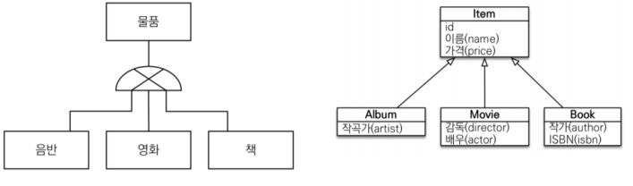

# 고급매핑
- 상송관계매핑 : 객체의 상속 관계를 데이터베이스에 매핑하는법
- `@MappedSuperClass` : 등록일, 수정일 같이 여러 엔티티에서 공통으로 사용하는 매핑 정보만 상속 받고 싶을때 사용
- 복합키와 식별 관계 매핑 : DB의 식별자가 하나 이상일 경우 매핑하는법
- 조인 테이블 : 테이블 외래 키 하나로 연관관계를 맺을수 있찌만 연관관계를 관리하는 연결테이블을 두는 방법
- 엔티티 하나에 여러 테이블 매핑하기 : 엔티티하나에 테이블 하나를 매핑하지만 엔티티하나에 여러 테이블을 매핑하는법

##상속관계 매핑
관계형 데이터베이스 에는 객체지향 언어에서 다루는 상속이라는 개념이 없다. 대신 슈퍼타입, 서브타입 관계 라는 모델링 기법이 객체의 상속개념과 가장 유사하다.
ORM에서 이야기하는 상속관계 매핑은 객체의 상속 구조와 데이터베이스의 슈퍼타입, 서브타입 관계를 매핑하는 것이다.

슈퍼타입 서브타입 논리 모델을 실제 물리 모델인 테이블로 구현할 때는 3가지 방법을 선택할 수 있다.

- 각각의 테이블로 변환 : 각각 모두를 테이블로 만들고 조회할때 조인을 사용한다.(JPA에선 조인 전략)
- 통합 테이블로 변환 : 테이블을 하나만 사용해서 통합한다, (JPA에서는 단일 테이블 전략)
- 서브타입 테이블로 변환 : 서브타입마다 하나의 테이블을 만든다.(JPA에서는 구현 클래스마다 테이블 전략)

#### 조인전략

엔티티 각각을 모두 테이블로 만들고 자식 테이블이 부모테이블의 기본키를 받아서 기본키 + 외래키로 사용하는 전략이다.
- 조회할떄 조인을 자주사용
- 주의할점이 존재한다 객체는 타입으로 구분할 수 있지만 테이블은 타입의 개념이 없어서 타입을 구분하는 컬럼을 추가해야한다.(해당 그림에서는 `DTYPE`컬럼을 구분 컬럼으로 둠)

 `@Inheritance(strategy = InheritanceType.JOINED)` : 상속 매핑은 부모 클래스에 해당 어노테이션을 사용해야한다 그리고 매핑전략을 지정해야함

`@DiscriminatorColumn(name = "DTYPE")` : 부모클래스에 구분 컬럼을 지. 이컬럼으로 저장된 자식 테이블을 구분 가능하다.

`@DiscriminatorValue("M")` : 엔티티를 저장할 때 구분 컬럼에 입력할 값을 지정. 만약 영화 엔티티에 저장하면 구분 컬럼인 DTYPE값이 M이된다.

장점
- 테이블이 정규화 된다
- 외래 키 참조 무결성 제약조건을 활용할 수 있다.
- 저장공간을 효율적으로 사용한다.

단점
- 조회할 때 조인이 많이 사용되므로 성능이 저하될 수 있다.
- 조회 쿼리가 복잡하다.
- 데이터를 등록할 INSERT SQL을 두번 실행한다.

특징
- 구분 컬럼을 꼭 사용해야 한다. `@DiscriminatorColumn`을 꼭 설정해야한다
- `@DiscriminatorColumn`을 지정하지 않으면 기본으로 엔티티 이름을 사용한다(예: Movie, Album, Book)

  