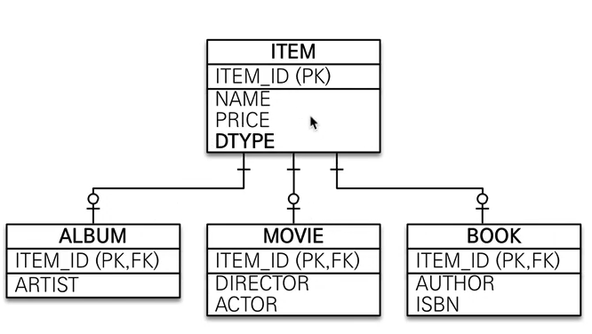
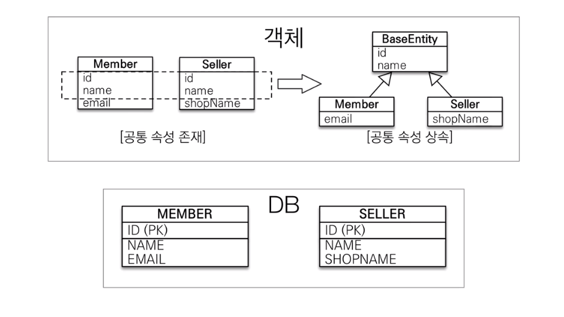
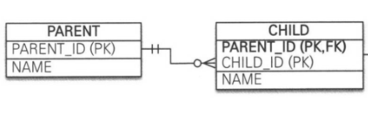
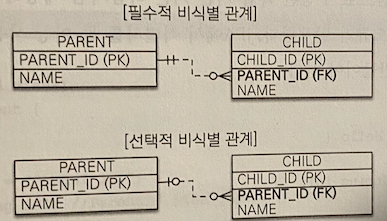
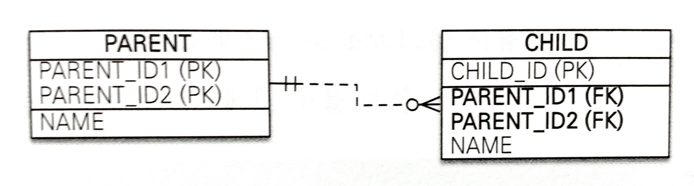
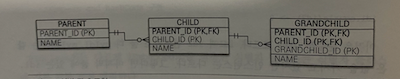
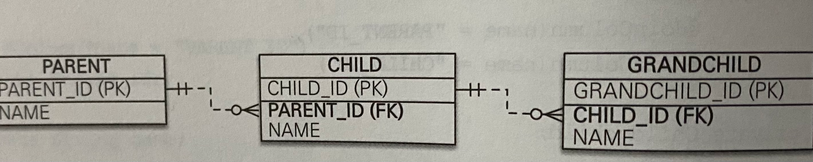
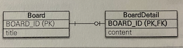

# 고급매핑

- 상송관계매핑 : 객체의 상속 관계를 데이터베이스에 매핑하는법
- `@MappedSuperClass` : 등록일, 수정일 같이 여러 엔티티에서 공통으로 사용하는 매핑 정보만 상속 받고 싶을때 사용
- 복합키와 식별 관계 매핑 : DB의 식별자가 하나 이상일 경우 매핑하는법
- 조인 테이블 : 테이블 외래 키 하나로 연관관계를 맺을수 있찌만 연관관계를 관리하는 연결테이블을 두는 방법
- 엔티티 하나에 여러 테이블 매핑하기 : 엔티티하나에 테이블 하나를 매핑하지만 엔티티하나에 여러 테이블을 매핑하는법

## 상속관계 매핑

관계형 데이터베이스 에는 객체지향 언어에서 다루는 상속이라는 개념이 없다. 대신 슈퍼타입, 서브타입 관계 라는 모델링 기법이 객체의 상속개념과 가장 유사하다. ORM에서 이야기하는 상속관계 매핑은 객체의 상속 구조와
데이터베이스의 슈퍼타입, 서브타입 관계를 매핑하는 것이다.

슈퍼타입 서브타입 논리 모델을 실제 물리 모델인 테이블로 구현할 때는 3가지 방법을 선택할 수 있다.

- 각각의 테이블로 변환 : 각각 모두를 테이블로 만들고 조회할때 조인을 사용한다.(JPA에선 조인 전략)
- 통합 테이블로 변환 : 테이블을 하나만 사용해서 통합한다, (JPA에서는 단일 테이블 전략)
- 서브타입 테이블로 변환 : 서브타입마다 하나의 테이블을 만든다.(JPA에서는 구현 클래스마다 테이블 전략)

#### 조인전략


엔티티 각각을 모두 테이블로 만들고 자식 테이블이 부모테이블의 기본키를 받아서 기본키 + 외래키로 사용하는 전략이다.

- 조회할떄 조인을 자주사용
- 주의할점이 존재한다 객체는 타입으로 구분할 수 있지만 테이블은 타입의 개념이 없어서 타입을 구분하는 컬럼을 추가해야한다.(해당 그림에서는 `DTYPE`컬럼을 구분 컬럼으로 둠)

`@Inheritance(strategy = InheritanceType.JOINED)` : 상속 매핑은 부모 클래스에 해당 어노테이션을 사용해야한다 그리고 매핑전략을 지정해야함

`@DiscriminatorColumn(name = "DTYPE")` : 부모클래스에 구분 컬럼을 지. 이컬럼으로 저장된 자식 테이블을 구분 가능하다.

`@DiscriminatorValue("M")` : 엔티티를 저장할 때 구분 컬럼에 입력할 값을 지정. 만약 영화 엔티티에 저장하면 구분 컬럼인 DTYPE값이 M이된다.

장점

- 테이블이 정규화 된다
- 외래 키 참조 무결성 제약조건을 활용할 수 있다.
- 저장공간을 효율적으로 사용한다.

단점

- 조회할 때 조인이 많이 사용되므로 성능이 저하될 수 있다.
- 조회 쿼리가 복잡하다.
- 데이터를 등록할 INSERT SQL을 두번 실행한다.

특징

- 구분 컬럼을 꼭 사용해야 한다. `@DiscriminatorColumn`을 꼭 설정해야한다
- `@DiscriminatorColumn`을 지정하지 않으면 기본으로 엔티티 이름을 사용한다(예: Movie, Album, Book)

#### 구현 클래스마다 테이블 전략


구현 클래스마다 테이블전략(Table-per-Concrete-Class Strategy)은 그림과 같이 자식 엔티티마다 테이블을 만든다 그리고 자식 테이블 각각에 필요한 컬럼이 모두 있다.

`@Inheritance(strategy = InhritanceType.TABLE_PER_CLASS)` 어노테이션을 통해 해당 전략을 선택하면된다.

장점

- 서브타입을 구분해서 처리할 때 효과적
- `not null`제약조건을 사용가능

단점

- 여러 자식 테이블을 함께 조회할 때 성능이 느리다(`SQL`에 `UNION`을 사용해야한다)
- 자식 테이블을 통합해서 쿼리하기 어렵다

특징

- 구분 칼럼을 사용하지 않는다.

#### `@MappedSuperclass`



지금 까지 본 상속관계 매핑은 부모클래스와 자식 클래스를 모두 데이터베이스 테이블과 매핑 했지만 부모클래스는 테이블과 매핑을 하지 않고 부모클래스를 상속 받는 자식 클래스에게 매핑 정보만 제공
하려면 `@MappedSuperClass`를 사용하면된다
`@MappedSuperclass`는 추상 클래스와 비슷한데 `@Entity`는 실제테이블과 매핑 되지만 `@MappedSuperclass`는 실제 테이블과 매핑되지 않는다.

- `@MappedSuperclass`로 매핑한 클래스는 `@Entity`로 매핑이 되지 않는다. 해당클래스를 상속받은 클래스는 자식엔티티에게 공통으로 사용되는 매핑정보만 제공한다.
- 부모로 부터 물려받은 매핑정보를 재정의하려면 `@AttributeOverrides`,`@AttributeOverride`를 사용한다

>
> 부모에게 상속 받은 id속성의 컬럼명을 `MEMBER_ID`로 재정의
>```java
>@Entity
>@AttributeOverride(name = "id", column = @Column(name = "MEMBER_ID"))
>public class Member extends BaseEntity{...}
>```
>둘이상을 재정의 하려면 `@AttributeOverrides`를 이용
> ```java
> @Entity
> @AttributeOverrides({
> @AttributeOverride(name = "id", column = @Column(name = "MEMBER_ID")),
> @AttributeOverride(name = "name", column = @Column(name = "MEMBER_NAME"))})
> public class Member extends BaseEntity {...}
>```

- 연관관계를 재정의하려면 `@associationOverrides`나 `@associationOverride`를 사용하면된다.

특징

- 테이블과 매핑되지 않고 자식 클래스에 엔티티의 매핑 정보를 상속하기 위해 사용
- `@MappedSuperClass`로 지정한 클래스는 엔티티가 아니므로 `em.find()`나 `JPQL`에서 사용이 불가능하다
- 이 클래스를 직접 생성해서 사용할 일은 거의 없다. 추상클래스로 만드는것을 권장한다.
- `@MappedSuperclass`는 테이블과는 관계가 없고 단순히 엔티티가 공통으로 사용하는 매핑정보를 모아주는 역할을 할 뿐이다.

> 참고
> - 엔티티는 엔티티 이거나 `@MappedSuperclass`로 지정한 클래스만 상속받을수 있다.
>

### 복합 키와 식별 관계 매핑

#### 식별관계 vs 비식별관계

데이터베이스 테이블 사이에 관계는 외래키가 기본 키에 포함되는지 여부에 따라 식별관계와 비식별관계로 구분한다

#### 식별관계



식별관계는 부모 테이블의 기본 키를 내려받아 자식 테이블의 기본키+외래키로 사용하는 관계다

`PARENT`테이블의 기본키 `PARENT_ID`를 받아서 `CHILD`테이블의 기본키 + 외래키로 사용한다

#### 비식별 관계

비식별 관계는 부모 테이블의 기본키를 받아서 자식 테이블의 외래키로만 사용하는 관계이다.


그림을 보면 `PARENT`테이블의 기본키 `PARENT_ID`를 받아 `CHILD`테이블의 외래키로만 사용한다.

비식별관계는 외래키에 `NULL`을 허용하는지에 따라 필수적 비식별 관계와 선택적 비식별 관계로 나눈다.

- 필수적 비식별 관계(Mandatory): 외래키에 `NULL`을 허용하지 않는다. 연관관계를 필수적으로 맺어야한다.
- 선택적 비식별 관계(Optional): 외래키에 `NULL`을 허용한다. 연관관계를 맺을지 말지 선택할 수 있다.

테이블을 설계할때 식별관계나 비식별 관계 중 하나를 선택해야한다. 최근에는 비식별 관계를 주로 사용하고 꼭 필요한 곳에만 식별관계를 사용하는 추세이다.

## 복합키: 비식별 관계 매핑

기본 키를 구성하는 컬럼이 하나면 다음 처럼 단수하게 매핑을 하면된다

```java

@Entity
public class Hello {
    @Id
    private String id;
}
```

하지만 둘 이상의 컬럼으로 구성된 복합 기본 키를 JPA에서 식별자 둘 이상을 사용하려면 별도의 식별자 클래스를 만들어야한다.

- JPA는 영속석 컨텍스트에 엔티티를 보관할때 엔티티의 식별자를 키로 사용한다. 그리고 식별자를 구분하기 위해 `equals`와 `hashCode`를 사용해서 동등석 비교를한다.
- 식별자 필드가 하나일 때는 보통 자바의 기본타입을 사용하므로 문제가 없지만 2개이상이면 식별자 클래스를 만들고 그곳에 `equals`와 `hashCode`를 구현해야 한다.
- JPA는 복합키를 지원하기위해 `@IdClass`와 `@EmbeddedId` 2가지 방법을 제공한다.

### @IdClass


`PARENT`테이블을 보면 기본 키를 `PARENT ID1`,`PARENT_ID2`로 묶은 복합 키로 구성했다. 해당봉합키를 매핑하기 위해선 식별자 클래스를 별도로 만들어야한다.

```java

@Entity
@IdClass(ParentId.class)
public class Parent {
    @Id
    @Column(name = "PARENT_ID1")
    private String id1;

    @Id
    @Column(name = "PARENT_ID2")
    private String id2;
}
```

- `PARENT`엔티티에서 기본키 컬럼을 `@Id`로 매핑하였다.
- `@IdClass`를 이용해 `ParentId`클래스를 식별자 클래스로 지정하였다,

```java
public class ParentId implements Serializable {
    private String id1;
    private String id2;

    public ParentId() {
    }

    public ParentId(String id1, String id2) {
        this.id1 = id1;
        this.id2 = id2;
    }

    @Override
    public int hashCode() {...}

    @Override
    public boolean equals(Object obj) {...}
}
```

`@IdClass`를 사용할때 식별자는 다음 조건을 만족해야한다.

- 식별자 클래스의 속성명과 엔티티에서 사용하는 식별자의 속성명이 같아야한다.
- `Serializable`인터페이스를 구현해야한다
- `equals`,`hashCode`를 구현해야한다.
- 기본생성자가 있어야한다.
- 식별자 클래스는 `public`이어야 한다.

```java

@Entity
public class Child {

    @Id
    private String id;

    @ManyToOne
    @JoinColumns({
            @JoinColumn(name = "PARENT_ID1", referencedColumnName = "PARENT_ID1"),
            @JoinColumn(name = "PARENT_ID2", referencedColumnName = "PARENT_ID2")
    })
    private Parent parent;
}
```

- 부모테이블의 기본키 컬럼이 복합 키이므로 자식 테이블의 외래키도 복합 키다.
- 외래키 매핑시 여러 컬럼을 매핑해야 하므로 `@JoinColumns`어노테이션을 사용하고 각각의 외래키 컬럼을 `@JoinColumn`으로 매핑한다.
- 해당 예제처럼 `@JoinColumn`의 `name`속성과 `referencedColumnName` 속성의 값이 같으면 `referencedColumnName`은 생략이 가능하다.

### `@EmbeddedId`

`@IdClass`가 데이터베이스에 맞춘 방법이라면 `@EmbeddedId`는 좀 더 객체지향적인 방법이다.

```java

@Embeddable
public class ParentId implements Serializable {
    @Column(name = "PARENT_ID1")
    private String id1;
    @Column(name = "PARENT_ID2")
    private String id2;
//equals, hashcode
}
```

- `@IdClass`와 다르게 `@EmbeddedId`를 적용한 식별자 클래스는 식별자 클래스에 기본키를 직접 매핑한다
- `@Embeddable`어노테이션을 붙여주어야한다
- `@Serializable` 인터페이스를 구현해야한다.
- `equals`, `hashCode`를 구현해야 한다.
- 기본 생성자가 있어야 한다.
- 식별자 클래스는 `public`이어야 한다.

#### 복합키와 `equals()`,`hashCode()`

복합키는 equals()와 hashCode()를 필수로 구현해야한다.

```java
        ParentId id1=new ParentId();
        id1.setId1("myId1");
        id1.setId2("myId2");

        ParentId id2=new ParentId();
        id2.setId1("myId1");
        id2.setId2("myId2");

        System.out.println(id1.equals(id2));
```

해당 코드를 보면 id1과 id2 인스턴스 둘 다 myId1, myId2라는 같은 값을 가지고 있지만 인스턴스는 다르다. equals()를 적절히 오버라이딩 했다면 마지막 출력값은 참이다.

영속성 컨텍스트는 엔티티의 식별자를 키로 사용해서 엔티티를 관리한다. 그리고 식별자를 비교할때 `equals()`,`hashCode()`를 사용한다. 따라서 식별자 객체의 동등성이 지켜지지 않으면 예상과는 다른
엔티티가 조회되거나 엔티티를 찾을수 없는등 영속성컨텍스트가 엔티티를 관리하는데 있어서 심각한 문제가 발생할수도있다.

#### `@IdClass`, `@EmbeddedId`

`@IdClass`와 `@EmbeddedId`는 각각 장단점이 있다.
`@EmbeddedId`가 `@IdClass`와 비교해서 더 객체지향적이고 중복도 없어서 좋아보이긴 하지만 특정 상황에 JPQL이 조금 더 길어질 수 있다.

```java
em.createQuesry("select p.id.id1, p.id.id2 from Parent p"); //@EmneddedId
        em.createQuesry("select p.id1, p.id2 from Parent p"); //@IdClass
```

> 복합키에는 `@GenerateValue`를 사용할 수 없다. 복합 키를 구성하는 여러 컬럼중 하나에도 사용할 수 없다.

### 복합 키 식별관계 매핑



해당 테이블은 부모, 자식, 손자까지 계속 기본 키를 전달하는 식별 관계이다. 식별관계에서 자식 테이블은 부모 테이블의 기본 키를 포함해서 복합 키를 구성해야 하므로 `@IdClass`나 `@EmbeddedId`를
사용해서 식별자를 매핑해야한다.

#### `@IdClass`와 식별 관계

식별관계는 기본 키와 외래 키를 같이 매핑해야한다. 따라서 식별자 매핑인 `@Id`와 연관관계 매핑인 `@ManyToOne`을 같이 매핑한다.

`Child`엔티티의 `parent`필드를 보면 `@Id`로 기본키를 매핑하면서 `@ManyToOne`과 `@JoinColumn`으로 외래 키를 같이 매핑한다.

```java
public class Child {

    @Id
    @ManyToOne
    @JoinColumn(name = "PARENT_ID")
    public Parent parent;

    @Id
    @Column(name = "CHILD_ID")
    private String childId;
...
```

#### `@EmbeddedId`와 식별 관계

`@EmbeddedId`로 식별 관계를 구성시에는 `@MapsId`를 사용해야한다.

`@EmbeddedId`는 식별관계로 사용할 연관관계의 속성에 `@MapsId`를 사용하면 된다.

`Child`엔티티의 필드를 보면 `@IdClass`와 다른 점은 `@Id`대신 `@MapsId`를 사용한 점이다.
`@MapsId`는 외래키와 매핑한 연관관계를 기본 키에도 매핑하겠다는 뜻이다. 해당 어노테이션의 속성 값은 `@EmbeddedId`를 사용한 식별자 클래스의 기본 키 필드를 지정하면 된다.
여기서는 `ChildId`의 `parentId`필드를 선택했다.

```java
    @MapsId("parentId")
@ManyToOne
@JoinColumn(name = "PARENT_ID")
public Parent parent;
```

### 비식별 관계로 구현



```java

@Entity
public class Parent {

    @Id
    @GeneratedValue
    @Column(name = "PARENT_ID")
    private Long id;

    private String name;
}

@Entity
public class Child {

    @Id
    @GeneratedValue
    @Column(name = "CHILD_ID")
    private Long id;

    private String name;

    @ManyToOne
    @JoinColumn(name = "PARENT_ID")
    private Parent parent;
}

@Entity
public class GrandChild {
    @Id
    @GeneratedValue
    @Column(name = "GRADCHILD_ID")
    private Long id;
    private String name;

    @ManyToOne
    @JoinColumn(name = "CHILD_ID")
    private Child child;
}
```

식별관계의 복합키를 사용한 코드와 비교하면 매핑도 쉽고 코드도 단순하다. 그리고 복합키가 존재하지 않으므로 복합키 클래스를 만들지 않아도 된다.

#### 일대일 식별관계



그림을 보면 일대일 식별 관계는 자식 테이블의 기본 키 값으로 부모 테이블의 기본키 값만 사용한다. 부모테이블의 곤키가 복합키가 아니면 자식테이블의 기본키는 복합 키로 구성하지 않아도 된다.

```java

@Entity
public class BoardDetail {

    @Id
    private Long boardId;

    @MapsId
    @OneToOne
    @JoinColumn(name = "BOARD_ID")
    private Board board;
}
```

`BoardDetail`처럼 식별자가 단순히 컬럼 하나면 `@MapsId`를 사용하고 속성 값은 비워두면 된다
`@MapsId`는 `@Id`를 사용해서 식별자가 지정한 `BoardDetail.boardId`와 매핑된다.

#### 식별, 비식별관계읜 장단점

데이터베이스 설계 관점에서 보면 식별관계보다는 비식별 관계를 선호한다

- 식별관계는 부모 테이블의 기본키를 자식테이블로 전파하면서 자식테이블의 기본키 컬럼이늘어난다.

> 부모테이블은 기본 키 컬럼이 하나였지만 자식 테이블은 기본 키 컬럼이 2개, 손자 테이블은 기본 키 컬럼이 3개로 점점 늘어난다.
> 결국 조인 할때 SQL이 복잡해지고 기본 키 인덱스가 불필요하게 커질수도 있다.

- 식별 관계는 2개이상의 컬럼을 합해서 복합 기본 키를 만들어야 하는 경우가 많다
- 식별관계를 사용할때 기본키로 비즈니스 의미가 있는 자연키 컬럼을 조합하는 경우가 많다. 반면 비식별 관계는 비즈니스와 전혀 관계없는 대리 키를 주로 사용한다.

> 비즈니스요구사항은 시간이 지남에 따라 언젠가는 변한다. 식별관계의 자연키 컬럼들이 자식에 손자까지 전파되면 변경하기 힘들다.

- 식별관계는 부모테이블의 기본키를 자식 테이블의 기본 키로 사용하므로 비식별관계보다 테이블 구조가 유연하지 못하다.

객체관계 매핑의 관점에서 보면 비식별관계를 선호한다

- 일대일 관계를 제외하고 식별 관계는 2개 이상의 컬럼을 묶은 복합 기본키를 사용한다.

> JPA에서 복합 기본 키는 별도의 복합키 클래스를 만들어 사용해야한다. 따라서 컬럼이 하나인 기본키를 매핑하는 것보다 많은 노력이 필요하다.

- 비식별 관계의 기본키는 주로 대리키를 사용하는데 JPA는 `@GenerateValue`처럼 대리키를 생성하기 위한 편리한 방법을 제공한다.

> 식별키가 가지는 장점
> - 기본키 인덱스를 활용하기 좋다
> - 상위테이블 들의 기본키 컬럼을 자식, 손자 테이블들이 가지고 있으므로 특정 상황에 조인 없이 하위 테이블 만으로 검색을 완료할수 있다.
>
> 기본키 인덱스를 활용하는 예
> - 부모의 아이디가 A인 모든 자식조회
> ```sql
> SELECT  * FROM CHILD
> WHERE PARRENT_ID = 'A'
> ```
> - 부모 아이디가 A이고 자식 아이디가 B인 자식조회
> ```sql
> SELECT * FROM CHILD
> WHERE PARENT_ID = 'A' AND CHILD_ID = 'B'
>```
> 두 경우 모두 `CHILD`테이블의 기본 키 인덱스를 PARENT_ID+ CHILD_ID로 구성하면 별도의 인덱스를 생서할 필요 없이 기본 키 인덱스만 사용해도 된다.

### 조인 테이블

데이터베이스 테이블의 연관관계를 설계하는 방법

- 조인 컬럼 사용(외래키)
  > 조인컬럼이라 부르는 외래키 컬럼을 사용해서 관리한다.
- 조인 테이블 사용(테이블 사용)

> 조인 테이블은 별도의 테이블을 이용해서 연관관계를 관리한다.(조인테이블은 연결테이블, 링크테이블이라고도 함)

#### 일대일 조인테이블

```java

@Entity
public class Parent {
    @Id
    @GeneratedValue
    @Column(name = "PARENT_ID")
    private Long id;
    private String name;

    @OneToOne
    @JoinTable(name = "PARENT_CHILD",
            joinColumns = @JoinColumn(name = "PARENT_ID"),
            inverseJoinColumns = @JoinColumn(name = "CHILD_ID"))
    private Child child;
    ...
}

@Entity
public class Child {
    @Id
    @GeneratedValue
    @Column(name = "CHILD_ID")
    private Long id;
    private String name;
    ...
}
```
- `@JoinTable`의 속성
  
  |속성|내용|
  |------|--------------------|
  |name|매핑할 조인 테이블|
  |joinColumns|현재 엔티티를 참조하는 외래키|
  |inverseJoinColumns|반대방향 엔티티를 참조하는 외래키|
- 양방향 매핑시 다음코드를 추가하면된다

```java
public class Child {
    ...
  @OneToOne(mappedBy = "child")
  private Parent parent;
    ...
}
```