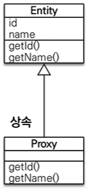
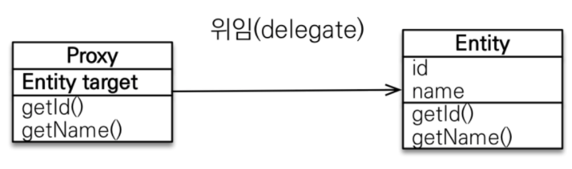

# 프록시와 연관관계 관리

- 프록시와 즉시로딩, 지연로딩 : JPA는 프록시라는 기술을 이용하여 처음부터 연관된 객체를 DB에서 조회하는게 아니라 실제 사용하는 시점에 db에서 조회 할수 있다.
- 영속성 전이와 고아 객체 : JPA는 연관된 객체를 함께 저장하거나 함께 삭제할수 있는 영속성 전이와 고아 객체 제거라는 편리한 기능을 제공한다

## 프록시

엔티티를 조회할 때 연관된 엔티티들이 항상 사용되는것이 아닌 회원 엔티티를 조회할때 연관된 팀 엔티티는 비즈니스 로직에 의해 사용될 경우도 있고 아닌경우도 있다.

```java
    public static void printUserAndTeam(EntityManager em){
        Member member=em.find(Member.class,"회원1");
        Team team=member.getTeam();
        System.out.println("회원 이름: "+member.getUsername());
        System.out.println("소속팀 : "+team.getName());
        }
public static void printUser(EntityManager em){
        Member member=em.find(Member.class,"회원1");
        System.out.println("회원 이름: "+member.getUsername());
        }
```

첫번째 코드의 `printUserAndTeam()`메서드는 회원의 이름으로 `Member`엔티티를 조회하고 연관된 `Team`엔티티도 조회한다. 반면 `printUser()`메서드는 `Member`엔티티만 조회하므로
연관된 `Team`엔티티까지 함께 DB에서 조회하는 것은 효율적이지 못하다. JPA에서는 이런 문제를 해결하기위해 DB에서 조회를 지연하는 방법을 제공한다. 이것이 `지연로딩`이다. `team.getName()`처럼
팀 엔티티의 값을 실제로 사용하는 시점에 DB에서 조회 하게 된다.
`이 지연 로딩 기능을 사용하려면 실제 엔티티 객체 대신 데이터베이스의 조회를 지연할수 있는 가짜 객체가 필요한데 이 가짜 객체가 프록시 객체라고한다.`

### 프록시 기초

JPA에서 식별자로 엔티티 하나를 조회할 때는 `EntityManager.find()`를 사용한다.

```java
Member member=em.find(Member.class,"member1");
```

이렇게 엔티티를 직접 조회시 엔티티를 실제로 사용하든 사용하지 않든간에 DB를 조회한다. 엔티티를 실제 사용하는 시점 까지 DB조회를 미루고 싶을경우 `EntityManager.gerReference()`메서드를
이욯마ㅕㄴ된다

```java
Member member=em.getReference(Member.class,"member1");
```

이 메서드를 호출할때 JPA는 DB를 조회하지 않고 실제 엔티티 객체도 생성하지 않는다. 대신 DB접근을 위임한 프록시 객체를 반환한다.

#### 프록시의 특징

프록시 클래스는 실제 클래스를 상속 받아 만들어진다. 실제 클래스와는 겉 모양이 같다.



- 사용하는 입장에서는 이것이 진짜 객체인지 프록시 객체인지 구분하지 않아도 된다.
- 프록시 객체는 실제 객체에 대한 참조(target)을 보관한다.
- 프록시 객체의 메서드를 호출하게되면 프록시 객체는 실제 객체의 메서드를 호출한다.
  

#### 프록시 객체의 초기화

프록시 객체는 `member.getName()`처럼 실제 사용될 때 DB를 조회해 실제 엔티티 객체를 생성한다. 이를 프록시 객체의 초기화라 한다.

- 프록시 예제

```java
//MemberProxy반환
Member meber=em.getReference(Member.class ,"id1");
        member.getName(); //1. getName
```

- 프록시 클래스 예상코드

```java
class MemberProxt extends Member {
    Member target = null;

    public String getName() {
        if (target == null) {
            //2. 초기화요청
            //3. DB조회
            //4. 실제 엔티티 생성 및 참조 보관
            this.target = ...;
        }
        //5. target.getName();
        return target.getName();
    }
}
```

1. 프록시 객체에 `member.getName()`을 호출, 실제 데이터 조회
2. 프록시 객체는 실제 엔티티가 생성되어 있지 않으면 영속성 컨텍스트에 실제 엔티티 생성을 요청한다(초기화)
3. 영속성 컨텍스트는 DB를 조회해 실제 엔티티 객체를 생성
4. 프록시 객체는 생성된 실제 엔티티 객체의 참조를 Member target 멤버 변수에 보관한다.
5. 프록시 객체는 실제 엔티티 객체의 `getName()`을 호출해서 결과를 반환한다.

#### 프록시의 특징

프록시의 특징은 다음과 같다

- 프록시 객체는 처음 사용할 때 한번만 초기화된다.
- 프록시 객체를 초기화한다고 프록시 객체가 실제 엔티티로 바뀌는것이 아니라 프록시를 통해 실제 엔티티에 접근이 가능하다.
- 프록시객체는 원본 엔티티를 상속받은 객체이므로 타입체크시 주의가 필요하다.
- 영속성 컨텍스트에 찾는 엔티티가 이미 있으면 DB를 조회할 필요가 없다. `em.getReference()`를 호출해도 프록시가 아닌 실제 엔티티를 반환한다.
- 초기화는 영속성 컨텍스트의 도움을 받아야만 가능하다. 준영속 상태의 프록시를 초기화하면 문제가 발생한다.

#### 준영속 상태와 초기화

```java
//MemberProxy 반환
Member member=em.getReference(Member.class,"id1");
        transaction.commit();
        em.close(); //영속 컨텍스트 종료

        member.getName(); //준영속 상태 초기화 시도
```

해당 코드를 보게 되면 `em.close()`메소드로 영속성컨텍스트를 종료해서 `member`는 준영속 상태이다.
`member.getName()`을 하게 되면 프록시를 초기화해야 하지만 영속컨텍스트가 존재하지 않으므로 실제 엔티티 조회가 불가능해 예외가 발생한다.

## 프록시와 식별자

엔티티를 프록시로 조회할 경우 식별자(PK) 값을 파라미터로 전달하는데 프록시 객체는 이값을 보관한다.

```java
Team team=em.getReference(Team.class,"team1"); //식별자 보관
        team.getId(); // 초기화 되지 않음
```

해당 모드를 보면 프록시 객체는 식별자 값을 가지고 있으므로 식별자 값을 조회하는 `team.getId()`를 호출해도 프록시를 초기화 하지 않는다.
(단 엔티티 접근방식을 프로퍼티로 설정한 경우에만 초기화하지 않는다) 엔티티 접근 방식을 필드로 설정하게 되면 해당 메서드가 JPA는 id만 조회하는 메소드인지 다른 필드까지 활용해서 어떤일을 하는 메서드인지 알지
못해서 프록시 객체를 초기화 한다. 이를 이용해 연관관계 설정시 유용하게 사용가능하다.

```java
Member member=em.find(Member.class,"member1");
        Team team=em.getReference(Team.class,"team1"); //SQL 실행안함
        member.setTeam(team);
```

연관관계 설정시 식별자값만 이용하므로 프록시를 이요하게 되면 데이터베이스 접근 횟수를 줄일수 있다.

## 프록시 확인

JPA가 제공하는 `PersistenceUtil.isLoaded(Object entity)` 메서드 이용시 프록시 인스턴스의 초기화 여부 확인이 가능하다. 초기화 되지 않은 프록시 인스턴스는 `false`를
반환한다.

```java
boolean isLoaded=em.getEntityManagerFactory()
        .getPersistenceUnitUtil().isLoaded(entity);
```

조회한 엔티티가 진짜 엔티티인지 프록시로 조회한 것인지 확인하려면 클래스명을 직접 출력해보면 된다.

```java
System.out.println("memberProxy = "+member.getClass().getName());
```

```
결과 : meberProxtt = jpabook.domain.Member_$$_javassist_0
```

결과를 보면 ..javassist..라 되어 있는데 이것을 보고 프록시인 것을 확인할수 있다.(프록시를 생성하는 라이브러리에 따라 출력결과는 달라진다)

## 즉시 로딩과 지연로딩

프록시 객체는 주로 연관된 엔티티를 지연 로딩할때 사용한다.

- 즉시로딩: 엔티티를 조회할때 연관된 엔티티도 함꼐 조회한다.
- 지연로딩 : 연관된 엔티티를 실제 사용할 때 조회한다.

#### 즉시로딩

즉시로딩을 이용하려면 `@ManyToOne`의 `fetch`속성을 `EAGER`로 지정한다.

```java
    public static void ProxyTest(EntityManager em){
        Member member=em.find(Member.class,"회원1");
        Team team=member.getTeam();
        }
```
위의 예제를 실행시 회원과 팀을 즉시 로딩으로 설정했기 때문에 `member`를 조회하는 순간 `team`도 같이 조회한다. 이때 회원과 팀 두 테이블 모두 조회 해야 하므로 쿼르릴 2번 실행한것 같지만
대부분의 `JPA구현체는 즉시로딩을 최적화하기 위해 가능하면 조인쿼리를 이용힌다.`
```sql
    select member0_.username as username1_0_0_,
           member0_.TEAM_ID  as TEAM_ID2_0_0_,
           team1_.name       as name1_1_1_
    from Member member0_
             left outer join
         Team team1_ on member0_.TEAM_ID = team1_.name
    where member0_.username = ?
```
SQL을 살펴보면 회원과 팀을 조인을 통해 쿼리 한번으로 조회한것을 알수있다.

#### 지연 로딩
즉시로딩을 이용하려면 `@ManyToOne`의 `fetch`속성을 `LAZY`로 지정한다.

즉시로딩때 사용했던 코드를 다시 실행해보면 `em.find(Member.class,"회원1");` 를 호출하게 되면 회원만 조회하고 팀은 조회하지 않는다. 같이 조회한 회원의 `team`메머 변수에 프록시 객체를 넣어둔다
```java
Team team = member.getTeam(); // 프록시 객체
```
`반환된 팀 객체는 프록시 객체다. 이프록시 객체는 실제 사용될때 까지 데이터의 로딩을 미룬다. 그래서 이것을 지연로딩이라고 부른다`

