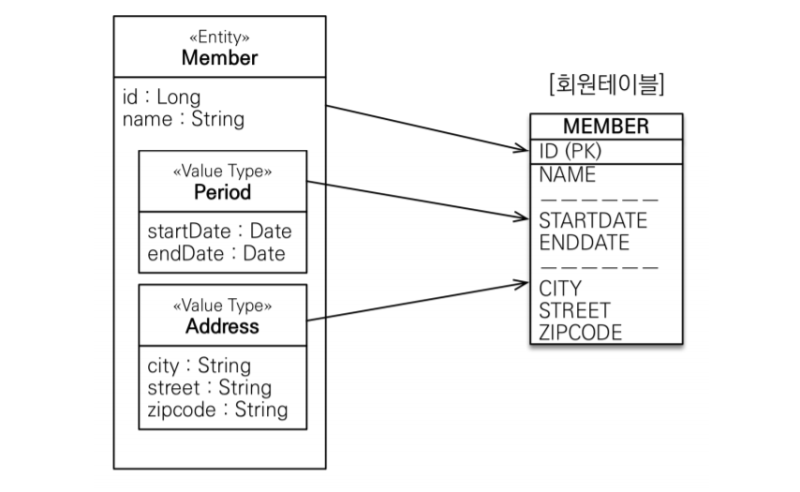
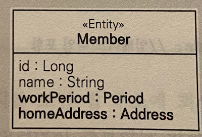

# 값 타입

JPA 데이터 타입

- 기본값 타입(basic value type)
    - 자바 기본 타입(예: int, double)
    - 래퍼 클래스 (예: Integer)
    - String
- 임베디드 타입(복합 값 타입)
- 컬렉션 값 타입

기본값 타입은 `String`,`int`처럼 자바가 제공하는 기본 데이터타입

임베디드 타입은 JPA에서 사용자가 직접 정의한 값 타입

컬렉션 값 타입은 하나 이상의 값 타입을 저장할 때 사용한다.

### 기본값 타입

```java

@Entity
public class Member {
    @Id
    @GeneratedValue
    private Long id;
    private String name;
    private int age;
}
```

Member에서 String, int가 값 타입이다.

### 임베디드 타입(복합 값 타입)

새로운 값 타입을 직접 정의해서 사용할수있다.

중요한것은 임베디드 타입도 `int`,`String`처럼 값타입이다.

```java

@Entity
public class Member {
    @Id
    @GeneratedValue
    private Long id;
    private String name;
    private int age;

    //근무기간
    @Temporal(TemporalType.DATE)
    java.util.Date startDate;
    @Temporal(TemporalType.DATE)
    java.util.Date endDate;

    //집주소
    private String city;
    private String street;
    private String zipcode;
}
```

기존의 코드를 보면 회원이 상세한 데이터를 그대로 가지고 있어서 객체지향적이지 않으며 코드의 응집력만 떨어트린다.

```java

@Entity
public class Member {
    ...
    //근무기간
    @Embedded
    Period period;
    //집주소
    @Embedded
    Address address;
  ...
}

@Embeddable
public class Address {
    @Column(name = "city")
    public String city;
    private String street;
    private String zipcode;
}

@Embeddable
public class Period {
    @Temporal(TemporalType.DATE)
    java.util.Date startDate;
    @Temporal(TemporalType.DATE)
    java.util.Date endDate;
}
```

변경된 코들르 보면 회원 엔티티가 더욱 의미있고 응집력 잇게 변한것을 볼수 있다.

임베디드 타입을 사용하려면 2가지 어노테이션이 필요하다

-`@Embeddable`: 값 타입을 정의하는 곳에 표시 -`@Embedded`: 값 타입을 사용하는곳에 표시

- 임베디드 타입을 포함한 모든 값 타입은 엔티티의 생명주기에 의존한다
- 엔티티와 임베디드 타입의 관계는 `컴포지션`관계이다.

> 참고
> - 하이버네이트는 임베디드 타입을 컴포넌트라 한다

### 임베디드 타입과 테이블 매핑



임베디드 타입은 엔티티의 값일 뿐이다. 임베디드타입이 속한 엔티티 테이블에 매핑한다.

임베디드 타입 덕분에 객체와 테이블을 아주 세밀하게 매핑하는 것이 가능하다.

> - 임베디드 타입과 UML
>
> UML에서 임베디드 값타입을 단순하게 표현가능하다
>
> 

### 임베디드 타입과 연관관계

임베디드 타입은 값 타이블 포함하거나 엔티티를 참조할 수 있다.

```java
@Entity
@Getter
@Setter
public class Member {
...
    @Embedded
    Address address;
    @Embedded
    PhoneNumber phoneNumber;
...
}

@Embeddable
public class Address {
    public String city;
    private String street;
    @Embedded
    Zipcode zipcode;
}
@Embeddable
public class Zipcode {
  String zip;
  String plusFour;
}
@Embeddable
public class PhoneNumber {
  String areaCode;
  String localNumber;
  @ManyToOne PhoneServiceProvider provider;
}
@Entity
public class PhoneServiceProvider {
  @Id
  String name;
}
```
- 값 타입인 `Address`가 값 타입인 `Zipcode`를 포함한다
- 값 타입인 `PhoneNumber`가 엔팉티 타입인 `PhoneServiceProvider`를 참조한다