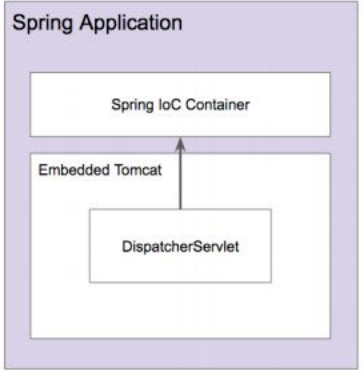

# 스프링 부트의 스프링 MVC 설정

- 스프링 부트의 "주관"이 적용된 자동 설정이 동작.
    - JSP보다 타임리프 선호
    - JSON 지원
    - 정적 리소스 지원 (+ 웰컴 페이지, 파비콘 등 지원)
- 스프링 MVC 커스터마이징
    - application.properties
    - `@Configuration` + implements WebMvcConfigurer: 스프링 부트의 스프링MVC 자동설정 + 추가설정
    - `@Configuration+ @EnableWebMvc + implement WebMvcConfigurer` 스프링 부트의 스프링 MVC 자동 설정을 사용하지 않음