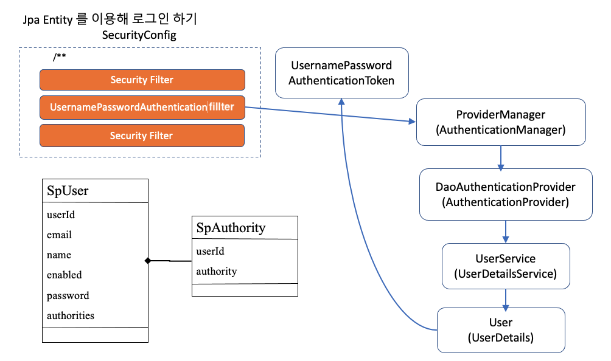

# AuthenticationProvider 와 UserDetailsService

1.` UsernamePasswordAuthenticationFillter`가 Token을 가지고 `ProviderManger` 에게 넘겨줌
2. `DaoAuthenticationProvider`(`AuthenticationProver`) 토큰을 처리한다.
3. `UserDetailsService` 에 token을 넘겨 `UserDetails`라는 `Principal`객체를 받는다