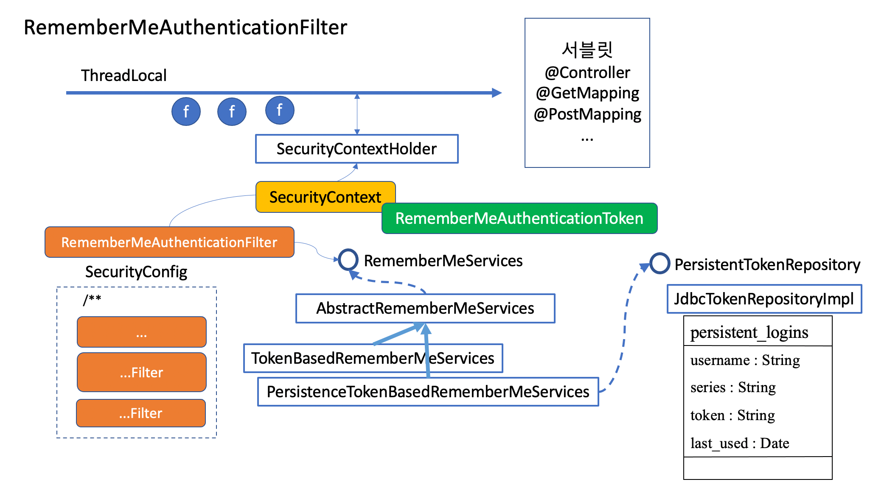

# 로그인을 지원하기 위한 필터들
## 스프링이 지원하는 로그인 하는 방식
- 로그인 처리
    - `Username Password Authentication`
      > - 폼로그인
      > - 세션 기반
    - `Basic Authentication`
      > - 클라이언트 로그인
      > - 세션(혹은 sessionless)
    - `OAuth2`로그인
      > - 로그인 위임
    - `JWT Token`(`Baarer`토큰)
      > - 클라이언트 로그인
      > - SessionLess(혹은 session)
## 스프링 시큐리티의 인증

Security Context를 request가 처리되는동안 유지시켜주기 위한 필터가 크게 2가지가 있다.

- SecurityContextPersistenceFilter : 세션이 유지되고 있는동안 시큐리티 컨텍스트가 유지되도록 도와준다.(세션이 만료된 이후라면 재로그인한다.)
  
  - 해당 필터는 기본적으로 SecurityContextRepository를 가지고 있다.
  - 여러가지 구현체를 가지고 있는데 Session을 다루므로 `HttpSessionSecurityContextRepository`(Http세션에 `SecurityConxtext`를 담는다) 가지고 있다.
  - 로그인을하고나면 그이후 부터는 세션에서 `SecurityContext`을 가져다가 `SecurityContextHolder`에다가 넣어준다.(`SecurityContextHolder`에다가 `Securitycontext`를 넣어주므로 로그인을 한거라 간주함)
  - `ThreadLocal`을 처리하고 나갈대는 `SecurityContextHolder`를 비워줌 으로써 `ThreadLocal`에서만 안전하도록 보장
    >참고
    > - [ThreadLocal](https://velog.io/@skygl/ThreadLocal) 
- RememberMeAuthenticationFilter : 인증 정보를 세션 관리하는 경우, 세션 timeout이 발생하게 도면, remember-me 쿠키를 이용해 로그인을 기억했다 자동으로 재로그인 시켜준다

>- key : Hash 암/복호화에 사용할 키 값
>- token-validity-seconds : 토큰 유효 기간
>- authentication-success-handler-ref : 핸들러를 커스마이징 했다면 로그인 성공 후 수행할 로직
>- user-service-ref : UserDetailsService를 커스터마이징 했을 경우 주입
- 세션이 만료된 이후에도 자동로그인을 통해서 서버에 로그인할수 있도록 하는 기능
- 쿠키에 리멤버미 토큰을 심어 놓는다

- TokenBaseRememberMeServices : 토큰기반, 토큰을 브라우저에 저장 (서버에는 남기지 않는방식)
    - 포멧 : 아이디:만료시간:Md5Hex(아이디:만료시간:비밀번호:인증키)
    - 만약 User가 password를 변경한다면 토큰을 사용할수 없음
    - 기본 유효기간은 14일 이며 설정가능
    - 약점 : 탈취된 토큰은 비밀번호를 바꾸지 않는한 유효기간동안 만능키가 됨

- PersistenceTokenBaseRememberMeServices : 토큰기반, 토큰을 브라우저에 저장 (서버에는 토큰을 저장해놓고 쓴다)
    - 포멧 : series:token
    - series값이 키가 된다. 일종의 채널  
    - series값을 준 이유는 user여러브라우저에서 접속할수 있기 때문에 같은유저라도 series값이 다르면 다른브라우저로 인식한다.
    - InmemoryTokenRepository 는 서버가 재시작하면 등록된 토큰들이 사라집니다. 따라서 자동로그인을 설정했더라도 다시 로그인을 해야 합니다. 재시작 후에도 토큰을 남기고 싶다면 `JdbcTokenRepository`를 사용하거나 이와 유사한 방법으로 토큰을 관리해야 합니다.
    - 로그아웃하게 다른 곳에 묻혀놓은 remember-me 쿠키값도 쓸모가 없게 됩니다. 만약 다른 곳에서 remember-me로 로그인한 쿠키를 살려놓고 싶다면, series 로 삭제하도록 logout 을 수정해야 한다.
    - Remeberme로 로그인한 사용자는 UsernamePasswordAuthenticationToken 이 아닌 RememberMeAuthenticationToken 으로 서비스를 이용하는 것입니다. 같은 사용자이긴 하지만, 토큰의 종류가 다르게 구분되어 있다.

