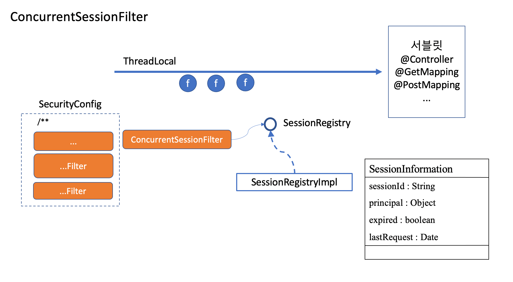

# 세션관리

서버는 기본적으 사용자를 판단할수 없다. 그래서 로그인을 통해 요청을 보낸 사용자를 판단하는데 이때 세션을 이용하게 된다. 하지만 모든 요청에 아이디/패스워드를 물어볼수는 없다. 그래서 토큰을 발급하 세션에는 토큰을
저장해 세션이 유지되는동안 또는 remember-me 토큰이 있다면 해당 토큰이 살아있는동안 로그인 없이 해당 토큰만으로 요청을 처리해준다.

- `ConcurrentSessionFilter` : `SessionRegistry`에 있는 `SessionInformation`에서 expired된 토큰이 들어오지 못하도 한다.

- `SessionManagementFilter` : 세션에대한 관리를 한다 해당 필터는 SessionAuthenticationStrategy라는 인터페이스를 가진다
  SessionAuthenticationStrategy 인터페이스는 onAuthentication이라는 메서드를 가진다. 이 메서드는 인증이 발생했을때 세션에 어떤 전략을 취할지 정한다.

스프링에서 제공하는 Strategy필터들은 크게 2가지로 나뉜다
- 세션 고정 정책에 대한 필터
- 동시접속을 제어하기 위한 필터